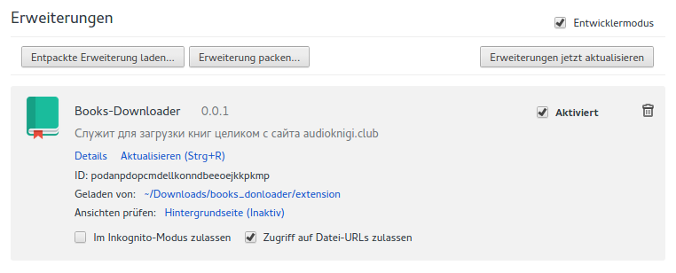
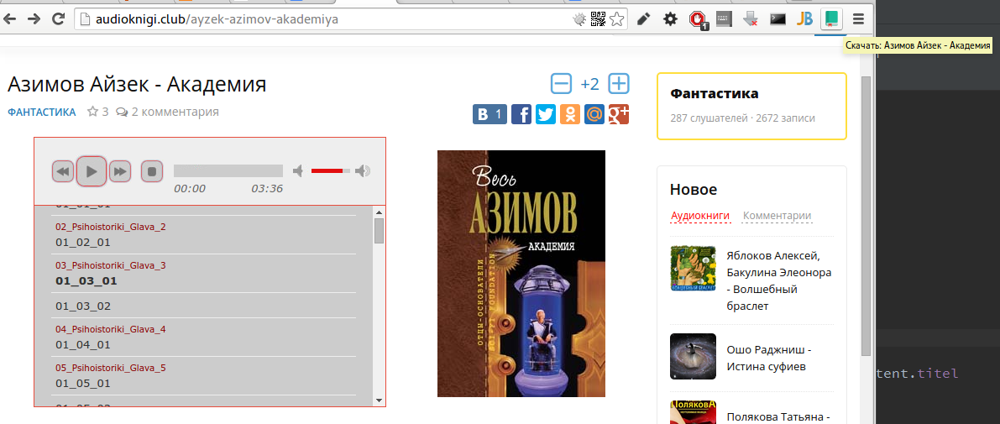
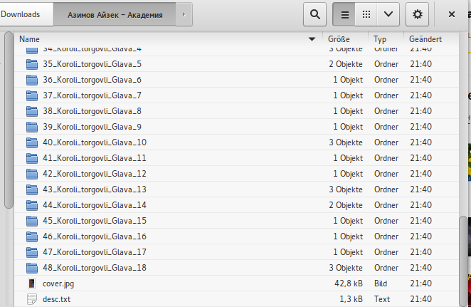

# Books-Downloader

Дополнение для Google-Chrome и Firefox (в том числе Firefox Андроид) которое позволяет скачивать Аудиокниги с сайта
[akniga.org](https://akniga.org/) целиком.

При Закачке создаётся отдельная папка, в которую будут сохранены все аудиофайлы а также описание и обложка.

## Усатановка (Google Chrome)

1. Качаем как ЗИП и распаковываем
2. заходим в "Extensions"
3. активируем "Developer mode" (как на картинке) 
4. выбираем папку "extension"



## Усатановка (Firefox)

1. Открываем [Firefox](https://www.mozilla.org/de/firefox/new/)
2. Устанавливаем [Add-On](https://addons.mozilla.org/de/firefox/addon/books-downloader/)

## Скриншоты
**В браузере**



**После закачки**



## Build

```shell
rm -fr audioknigi_donloader.zip
cd extension && zip -r "../audioknigi_donloader.zip" .
```

## Источники и лицензии

Иконки взяты [здесь](http://www.iconarchive.com/show/small-n-flat-icons-by-paomedia/book-bookmark-icon.html).

Лицензия: [Mozilla Public License, version 2.0](https://www.mozilla.org/en-US/MPL/2.0/)
